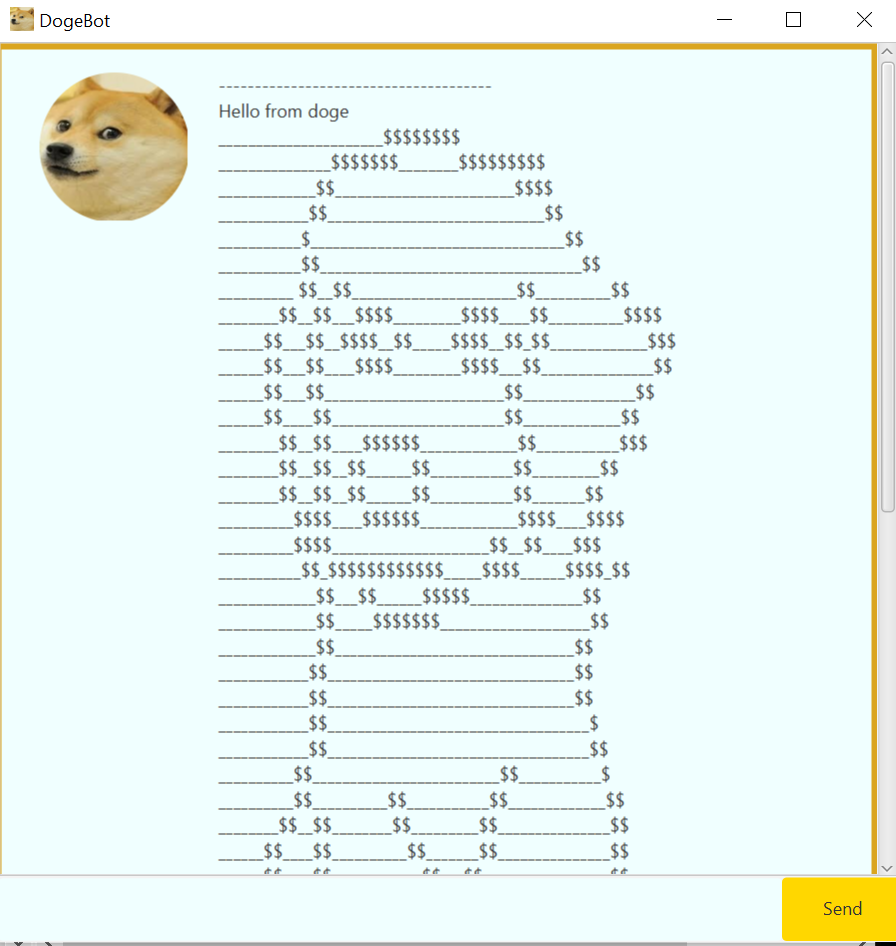

# User Guide

## Introduction

_DogeBot_ is a desktop app for managing tasks and its optimized for use via **Command Line Interface(CLI)** while
still having the benefits of a **Graphical User Interface(GUI)**.Therefore this app is suitable for fast typers.

## Quick start

1. Ensure you have Java `11` or above installed in your Computer.

2. You can download the latest version of DogeBot [here](https://github.com/davidcaiqifan/ip/releases/tag/Level8)

3. Download the `.jar` file and copy the file to the folder you want to use as the home folder for your DogeBot.

4. Double-click the file to start the app. You should be able to see the following in a few seconds.

Type the command in the command box and press Enter to execute it. e.g. typing list and pressing Enter will display all tasks.
Some example commands you can try:

_**list :**_ Lists all tasks.

_**remove 3**_ : Deletes the 3rd task shown in the current list.

**_bye_** : Exits the app.

Refer to the Features below for details of each command.
## Features 

### `Add task` 

Use the keyword **_todo_** followed by task description.

Example of usage: 

_todo feed dog_

Expected outcome:

_Added to list : [LOW] feed dog_

_You have a total of 1 tasks_

### `Show tasks` 

Type in the keyword **_list_** as input

Example of usage: 

_list_

Expected outcome:

Check out your missions!
_1.  [T] [LOW] feed doge [?]_

_You have a total of 1 tasks_

### `Remove` 

Use the keyword **_remove_** followed by task serial number as
shown by the **_list_** command

Example of usage: 

_remove 1_

Expected outcome:

_Task successfully removed!_

_-> [LOW] feed doge_

_You have a total of 0 tasks_

### `Remove` 

Use the keyword **_remove_** followed by task serial number as
shown by the **_list_** command

Example of usage: 

_remove 1_

Expected outcome:

_Task successfully removed!_

_-> [LOW] feed doge_

_You have a total of 0 tasks_

### `Mark as done` 

Use the keyword **_check_** followed by task serial number as
shown by the **_list_** command

Example of usage: 

_check 1_

Expected outcome:

_Such wow! I have completed the following task!_

_[LOW] feed dog [?]_

_You have a total of 1 tasks_

### `Add events` 

Use the keyword **_event_** followed by event description.
A date must be specified after the description with the
following format : **_event_** _description_ **_/on_** _YYYY-MM-DD_

Example of usage: 

_event east coast plan /on 2020-09-02_

Expected outcome:

_Added to list : [LOW] east coast plan on WEDNESDAY 2 SEPTEMBER 2020_

### `Add deadline` 

Use the keyword **_deadline_** followed by event description.
A date must be specified after the description with the
following format : **_deadline_** _description_ **_/by_** _YYYY-MM-DD_

Example of usage: 

_dead west coast plan /by 2020-10-02_

Expected outcome:

_Added to list : [LOW] west coast plan by FRIDAY 2 OCTOBER 2020_

### `Find task` 

Use the keyword **_find_** followed by search keyword.
Multiple keywords can be used by adding a _comma_ after the previous keyword.

Example of usage: 

_find dog,east_

Expected outcome:

_Doge found the following tasks you asked for!_

 _1.  [T] [LOW] feed doge [?]_
 
 _2.  [E] [LOW] east coast plan on WEDNESDAY 2 SEPTEMBER 2020 [?]_

### `Set priority` 

Use the keyword **_-PL_** followed by a number from _**1**_ to _**3**_ to indicate 
priority level of the task, with _**1**_ being the lowest priority and _**3**_ being the highest priority.
Otherwise, the default priority level is _low._

Example of usage: 

_todo feed doge -PL3_

Expected outcome:

_Added to list : [HIGH] feed doge_ 

### `Exit application` 

Use the keyword **_bye_** 

Example of usage: 

_bye_

Expected outcome:

_Doge would like to see you soon!_ 